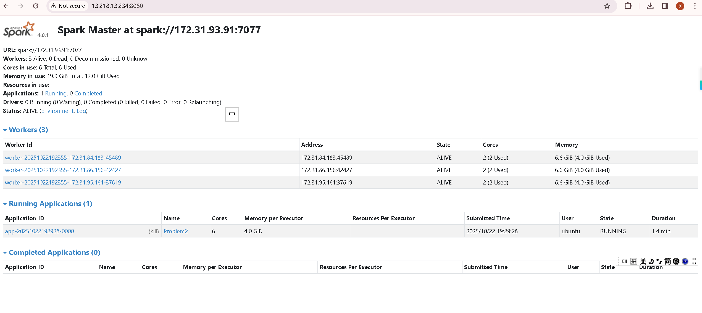
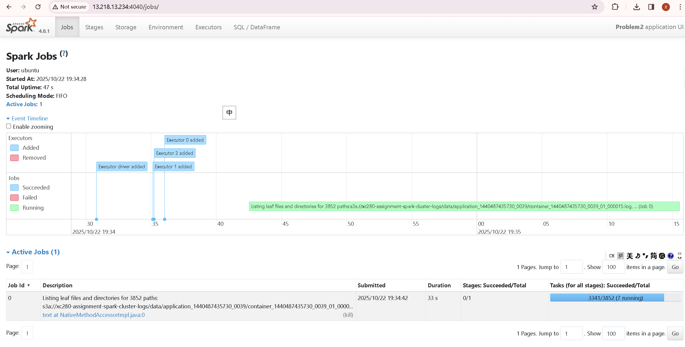

## Analysis Report

### Findings and Performance Analysis

For problem 1, log level counts are calculated through grouby and count. Filtering is also included to remove empty rows with no log level. And the second question is achieved through the use of rand() and then limit. The summary statistics is calculated based on answers from question 1 and question 2. From the results, we can see that most log entries are INFO level. And parsing success rate was >80%(rows with a valid log level and timestamps) after cleaning. Also, raw logs are large, so using regexp_extract and lazy evaluation avoided excessive driver memory use.

For problem 2, in addition to the sample code for extraction, I used try_to_timestamp() to safely parse datetime values and filtered out nulls. The time series are calculated through the use of spark_min(start time) and spark_max(end time). Aggregated cluster statistics are calculated by using groupby and agg(). And the two plots are built by using seaborn and matplotlib. From the result, I found that there are 6 unique clusters and 194 different applications in total. The average applications per cluster is 32.33. 

From the bar plot, 1485248649253 is the most heavily used cluster with a dominated usage of 181 applications. Other clusters had between 1–8 applications. From the density plot, we can tell that the majority of jobs cluster around 10³ seconds (~15–20 minutes). A small number of jobs extend beyond 10⁴ seconds, indicating long-tail executions. The log-scale plot shows the distribution is right-skewed, suggesting potential optimization opportunities for some workloads. Problem 2 is actually quicker compared to problem 1 since here we don't need to look into the content within all the log files.

### Screenshots of Spark Web UI

